\newpage 
\tableofcontents 
\newpage

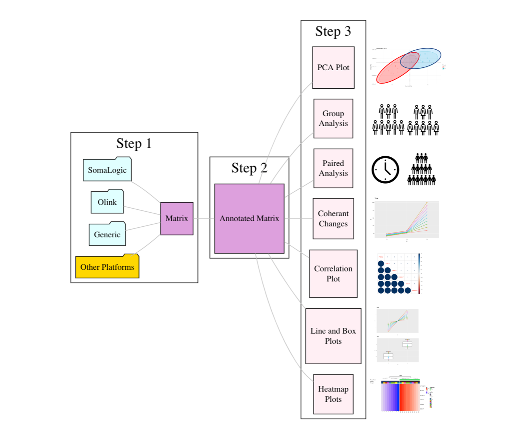{width=80%}

## Overview
This Web Tool was designed to be a user- friendly tool for the “non-bioinformaticians” to do preliminary analyses of proteomic (SomaLogic and Olink) and other data sets. The most up-to-date version of the tool can be accessed here: 
Below you will find some pointers for using the tool.

In addition to specific tool instructions, this document includes some suggestions for analyses. Please note that these are simply guidelines found to be useful based on previous experience. Every project is unique and these guidelines should be adapted as necessary. 

For further, please reach out to Foo Cheung at foo.cheung@nih.gov.

\newpage

  

## Quick Start Guide

 
 

**As Easy As Step 1, 2 And 3**

This section demonstrates how to prepare and analyze data.

**Step 1.** Select the correct entry page revelvant to your dataset:
  
  + SomaLogic
  + Olink
  + Generic

Step 1 entails converting your proteomic (e.g., SomaLogic or Olink) or other data from any source into a tab-delimited text file that contains a column for each protein/target measurement, a row for each sample, and an expression value for each target in each sample. 
Upload your data file as Input for matrix conversion, then download the resulting output file. Annotate the SampleID, Subject, Group and TimePoint columns. Save the file as a tab delimited text file, ready for uploading at Step2.

**Step 2.** 
Step 2 entails uploading your manually annotated file from Step 1, use the available features to filter the samples (rows) and assay data (columns) and proceed to Step3

**Step 3.** Use The Available Tools For Basic Analysis and Plotting 
Step 3 entails selecting the available tools to analyze and plot your data

\newpage

# User Manual

 

## Step 1
Step 1 entails converting your proteomic (e.g., SomaLogic or Olink) or other data from any source into a tab-delimited text file that contains a column for each sample, a row for each gene, and an expression value for each target in each sample. 

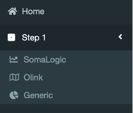{width=30%}

 
Click on the tab “Step 1”, you will be offered links to process different data sets. Click on the appropriate link for you data.

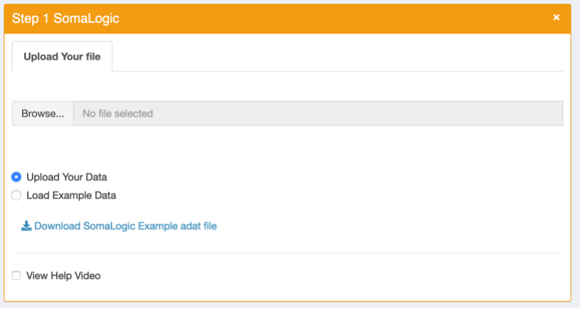{width=50%}

 
For Example: clicking on “SomaLogic” will bring up the box shown above.

Either upload your adat data file by clicking on “Browse” or “Load Example Data” to explore the features of the app without uploading any data.

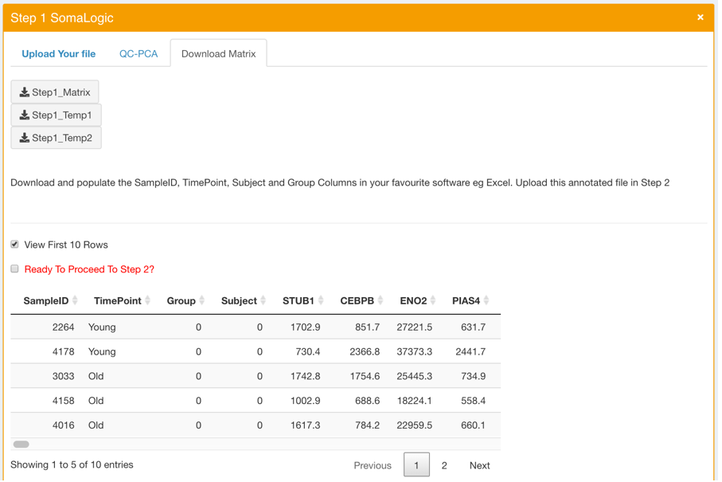{width=50%}

 
Click on the “Step1_Matrix” button and annotate the SampleID (unique), TimePoint, Group and Subject column before Proceeding to Step 2 by clicking on the “Go To Step 2” button. 

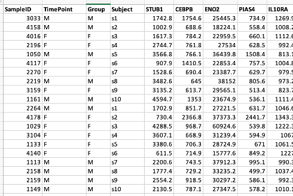{width=50%}

 
Before moving on different tabs you can also perform a Principal component analysis (PCA) on the data by clicking on the QC-PCA tab. The Samples, Buffers, Controls are plotted as a scatterplot along the top 2 principal components. These plots can provide useful QC checks by showing clusters based on SampleType for example: Buffers versus Samples versus controls or checking if different plates show a batch effect.

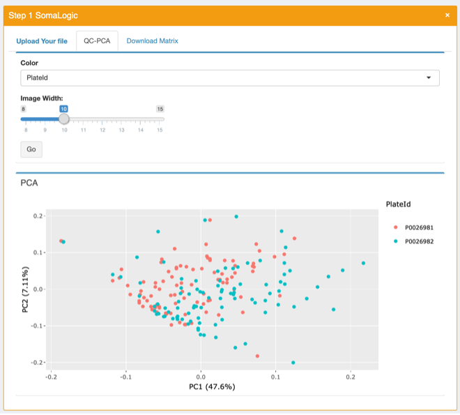{width=50%}

\newpage

## Step 2

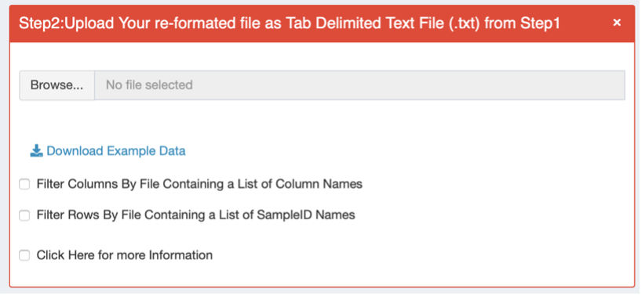{width=50%}

 
**File Format:** The current tool requires you upload your file as a **Tab Delimted text file (.txt)**. You can make modifications to the data file in Excel for example, but be sure to export the file to a **tab delimited format**.

Prior to uploading data, it is **important** to make sure **SampleID, TimePoint, Subject and Group columns**, as well as any other columns intended for use during the analysis, were annotated consistently.

Click on the “Browse” button and upload your annotated Tabbed Delimited Text data file (that you download **from Step 1** and then annotated for **SampleID (must be unique)**, TimePoint, Group and Subject column). **If there are no TimePoint and/or Group information, please enter 0 and do not leave them blank or NA**. The SampleID must be unique and containing no NA or blank values. **If there is only one Sample per Subject then the SampleID can be safely copied over to the Subject column**.

 

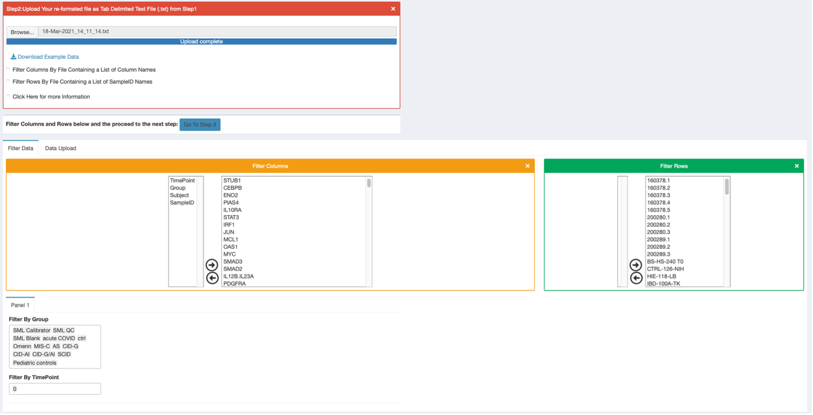{width=70%}

 

**Filtering both Samples (rows) and analytes (columns) can be done in a number of ways as shown below:** 

1.	Upload a single column of Samples or/and analytes that can filter out data automatically
2.	Manually filter rows/samples or/and analytes/columns using the dual list box shown above
3.	Filter Samples by using the annotated Group and or TimePoint information attached to each Sample 

\newpage

## Step 3

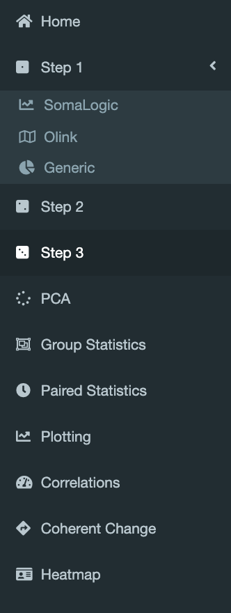{width=20%}

 

Clicking on the Step 3 button should allow the user to perform various analysis and plots as above.

\newpage

### PCA

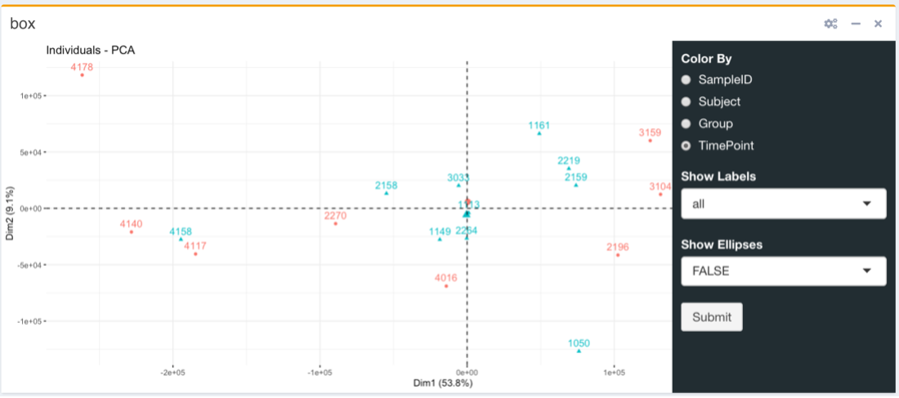{width=50%}

 

The Principle Component Analysis (PCA) is a tool used to reduce the dimensionality of datasets to increase interpretability by creating new uncorrelated variables that successively maximize variance. Principal Component Analysis (PCA) is a technique used to emphasize variation and bring out strong patterns in a dataset (dimensionality reduction).
Various options to color by different variables and show or hide labels is made available to the user by way of the menu. 

\newpage

### Group Statistics

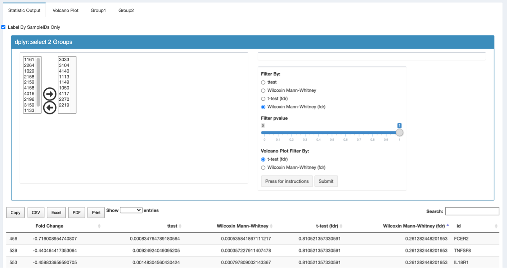{width=70%}

 

If you ran an experiment comparing two or more separate patient groups, such as diseased and healthy, you should use this Group Statistics option. Please note that this tool only allows you to compare two groups at a time. If you ran an experiment comparing one set of patients at multiple time points, you should use the Paired Data tab. 
Post Analysis: After you identify the most statistically significant results, as a quick QC, it is recommended you utilize the BoxPlots tool and plot the identified analyte and sample groups to visualize the difference.   
This tool can append the SampleGroup and TimePoint  to the SampleID, separated by an underscore. The samples can then be separated into two groups more easily based on the additional information attached to the data. The most powerful results will be evident in the fdr corrected data where the smallest value (the statistical p-value) is the most significant. To sort the output by smallest to largest in a column, select the gray arrows next to the statistical test name. If analyses reveal only a few significant analytes in the fdr corrected data, then reference the non-fdr corrected data. It is important to QC the groups that were analyzed to make sure that the samples you expected to be in the group(s), were in fact there. Results can be exported into various file formats including PDF and excel. To export the full list of results, be sure to update the Show __ entries box to be Show nth entries. If you do not make this change, the exported file will only contain the list of results currently visible in the browser. Volcano Plot, this tab will display a scatter plot of analytes statistical significance versus fold-change. 
The plot will show transformed p-value of the non-fdr corrected Wilcox Mann-Whitney. The plot does denote the fdr-corrected significant analytes with color coding. Although not called out, the Fold Change on the x-axis is a log2 scale.  

\newpage

### Paired Statistics

{width=70%}

 

A paired t-test is used when we are interested in the difference between two variables for the same subject. Often the two variables are separated by time.
In this data set, annotating the TimePoint is most important for pairing. Once a field is selected, the Select Pairs widget will automatically update so that when you hover over the data insert field, a dropdown list will appear of those options available in that data field.  
Data output from this tool is comparable to the Unpaired Data tool: the output will include both fdr and non-fdr correct statistical p-values for each analyzte. The data can be resorted for lowest p-value. It can be exported in various formats i.e. CSV, Excel, PDF. To export the full list of results, be sure to update the Show __ entries box to be Show nth entries. Like the tool above, it is very important to QC the two groups to ensure the data was properly annotated in the file.  

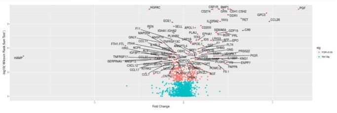{width=70%}

 

Volcano Plot (See Below). This tab will display a scatter plot of analytes statistical significance versus fold-change. 
The plot does denote the fdr-corrected significant analytes with color coding. Although not called out, the Fold Change on the x-axis is a log2 scale.

\newpage

###	Plotting

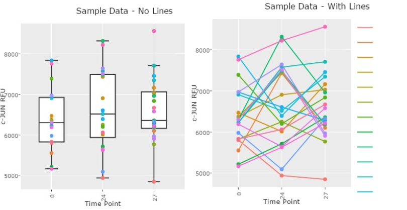{width=70%}

 

This tool allows you to analyze individuals across any variation of parameters on the X-Axis.   
When analyzing data with multiple time points for each patient, you may opt to select Join Data Points to see the connection between samples from the same patient across data points. To use this tool, be sure the option selected under Color matches what links your samples. For example, if your samples were time points from the same patient and the patient IDs are listed in the Subject column, be sure the option selected under Color is Subject.

\newpage

###	Correlation

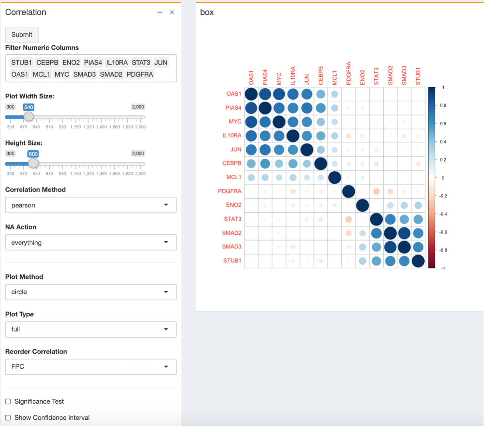{width=70%}

 

We used shiny as a wrapper for the package corrplot in the Correlation graphical display of a correlation matrix, confidence interval. It also contains some algorithms to do matrix reordering. See documentation for the corrplot for further details:
https://CRAN.R-project.org/package=corrplot 

\newpage

###	HeatMaps

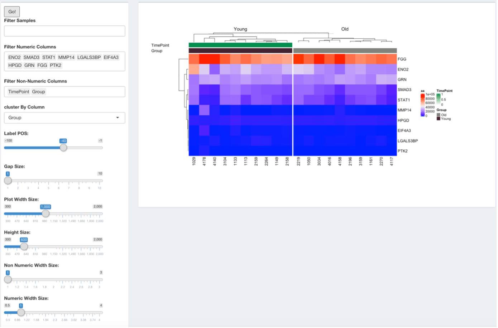{width=70%}

 

We used shiny as a wrapper for some of the functions from the R package ComplexHeatmap in the Heatmap graphical display of a matrix. See documentation for the ComplexHeatmap for further details:
https://www.bioconductor.org/packages/release/bioc/html/ComplexHeatmap.html

\newpage

###	Coherent Chnages

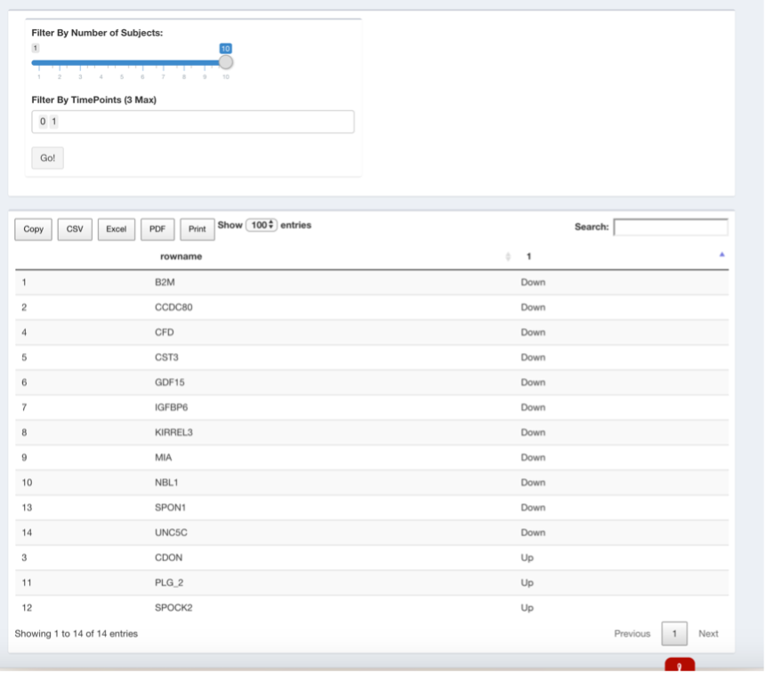{width=70%}

 

This tool is valuable in identifying subjects/samples that go up or down at each TimePoint. For example, the user may wish to know which direction the majority of samples are going at each TimePoint. The exact number of subjects that be determined using the select input box.

